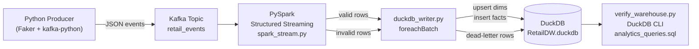

# Real-Time Retail Pipeline — Windows → Linux/DuckDB Migration Guide

> **Complete, production-grade step-by-step guide.**  
> All commands are copy-pasteable and tested on Ubuntu 22.04 LTS.

---

## Files Changed / Created

| File | Action |
|---|---|
| `config/config.py` | **Rewritten** – removed all SQL Server vars, added `DUCKDB_PATH` |
| `requirements.txt` | **Rewritten** – removed `pyodbc`, added `duckdb`, `kafka-python` |
| `warehouse/create_tables.sql` | **NEW** – DuckDB DDL replacing all three SQL Server scripts |
| `warehouse/duckdb_writer.py` | **NEW** – full DuckDB writer replacing `sql_server_writer.py` |
| `warehouse/analytics_queries.sql` | **Rewritten** – DuckDB SQL (no T-SQL syntax) |
| `spark/spark_stream.py` | **Updated** – imports `duckdb_writer`, no JDBC package |
| `verify_warehouse.py` | **NEW** – health-check / verification script |

---

## SECTION 1 — Linux Environment Setup

### 1.1 System Prerequisites

```bash
sudo apt update && sudo apt upgrade -y

# Java 17 (required by both Kafka and Spark)
sudo apt install -y openjdk-17-jdk

# Python 3, venv, pip, curl, wget, unzip
sudo apt install -y python3 python3-pip python3-venv curl wget unzip

# Verify
java -version          # openjdk 17.x.x
python3 --version      # Python 3.10+
```

### 1.2 Apache Kafka Setup

```bash
# Download Kafka 3.7
cd ~
wget https://downloads.apache.org/kafka/3.7.0/kafka_2.13-3.7.0.tgz
tar -xzf kafka_2.13-3.7.0.tgz
sudo mv kafka_2.13-3.7.0 /opt/kafka

# Add to ~/.bashrc
echo 'export KAFKA_HOME=/opt/kafka'      >> ~/.bashrc
echo 'export PATH=$PATH:$KAFKA_HOME/bin' >> ~/.bashrc
source ~/.bashrc

# Configure ZooKeeper data dir
sudo mkdir -p /var/zookeeper && sudo chown $USER /var/zookeeper
sed -i 's|dataDir=.*|dataDir=/var/zookeeper|' /opt/kafka/config/zookeeper.properties

# Configure Kafka log dir
sudo mkdir -p /var/kafka-logs && sudo chown $USER /var/kafka-logs
sed -i 's|log.dirs=.*|log.dirs=/var/kafka-logs|' /opt/kafka/config/server.properties

# Start ZooKeeper (background)
/opt/kafka/bin/zookeeper-server-start.sh \
    /opt/kafka/config/zookeeper.properties > /tmp/zookeeper.log 2>&1 &
sleep 5

# Start Kafka broker (background)
/opt/kafka/bin/kafka-server-start.sh \
    /opt/kafka/config/server.properties > /tmp/kafka.log 2>&1 &
sleep 5

# Create topics
kafka-topics.sh --create \
    --topic retail_events \
    --partitions 4 \
    --replication-factor 1 \
    --bootstrap-server localhost:9092

kafka-topics.sh --create \
    --topic retail_events_dead_letter \
    --partitions 2 \
    --replication-factor 1 \
    --bootstrap-server localhost:9092

# Verify
kafka-topics.sh --list --bootstrap-server localhost:9092
```

> [!TIP]
> To start Kafka on boot automatically, see the optional **systemd** section below.

### 1.3 Apache Spark Setup

```bash
cd ~
wget https://archive.apache.org/dist/spark/spark-3.5.1/spark-3.5.1-bin-hadoop3.tgz
tar -xzf spark-3.5.1-bin-hadoop3.tgz
sudo mv spark-3.5.1-bin-hadoop3 /opt/spark

cat >> ~/.bashrc << 'EOF'

# Spark / Java
export JAVA_HOME=/usr/lib/jvm/java-17-openjdk-amd64
export SPARK_HOME=/opt/spark
export PATH=$PATH:$SPARK_HOME/bin:$SPARK_HOME/sbin
export PYSPARK_PYTHON=python3
EOF

source ~/.bashrc
spark-submit --version   # confirms installation
```

### 1.4 Python Virtual Environment

```bash
cd "/media/khalidabdelrazk/01DC6291362F9420/real-time data pipeline"

python3 -m venv .venv
source .venv/bin/activate

pip install --upgrade pip
pip install -r requirements.txt

# Verify DuckDB
python3 -c "import duckdb; print('DuckDB', duckdb.__version__)"
```

---

## SECTION 2 — Database Initialisation

```bash
cd "/media/khalidabdelrazk/01DC6291362F9420/real-time data pipeline"
source .venv/bin/activate

# Create the warehouse directory
mkdir -p warehouse

# Bootstrap the DuckDB schema
duckdb warehouse/RetailDW.duckdb < warehouse/create_tables.sql

# Verify all tables exist
duckdb warehouse/RetailDW.duckdb \
  "SELECT table_name FROM information_schema.tables WHERE table_schema='main' ORDER BY 1;"
```

Expected output:
```
┌─────────────────────┐
│      table_name     │
├─────────────────────┤
│ dead_letter_events  │
│ dim_channel         │
│ dim_customer        │
│ dim_date            │
│ dim_product         │
│ dim_store           │
│ fact_sales          │
└─────────────────────┘
```

---

## SECTION 3 — Running the Pipeline

Open **three separate terminals**, all in the project root with the venv active.

### Terminal 1 — Kafka Producer

```bash
cd "/media/khalidabdelrazk/01DC6291362F9420/real-time data pipeline"
source .venv/bin/activate
python3 -m producer.producer
```

### Terminal 2 — PySpark Streaming Job

```bash
cd "/media/khalidabdelrazk/01DC6291362F9420/real-time data pipeline"
source .venv/bin/activate

spark-submit \
    --packages org.apache.spark:spark-sql-kafka-0-10_2.12:3.5.1 \
    --conf spark.driver.extraJavaOptions="-Dlog4j.logLevel=WARN" \
    spark/spark_stream.py
```

> [!IMPORTANT]
> `--packages` downloads the Kafka connector JAR on first run (requires internet).  
> The SQL Server JDBC package (`mssql-jdbc`) has been **completely removed**.

### Terminal 3 — Live Monitoring

```bash
cd "/media/khalidabdelrazk/01DC6291362F9420/real-time data pipeline"
source .venv/bin/activate

# Refresh row counts every 10 seconds
watch -n 10 python3 verify_warehouse.py
```

---

## SECTION 4 — Verification & Analytics

### 4.1 Python verification script

```bash
python3 verify_warehouse.py
# Custom DB path:
python3 verify_warehouse.py --db /path/to/RetailDW.duckdb
```

### 4.2 Interactive DuckDB CLI

```bash
duckdb warehouse/RetailDW.duckdb
```

```sql
-- Row counts for all tables
SELECT 'dim_customer'        AS tbl, count(*) AS n FROM dim_customer        UNION ALL
SELECT 'dim_product',                count(*) FROM dim_product               UNION ALL
SELECT 'dim_store',                  count(*) FROM dim_store                 UNION ALL
SELECT 'dim_date',                   count(*) FROM dim_date                  UNION ALL
SELECT 'dim_channel',                count(*) FROM dim_channel               UNION ALL
SELECT 'fact_sales',                 count(*) FROM fact_sales                UNION ALL
SELECT 'dead_letter_events',         count(*) FROM dead_letter_events
ORDER BY 1;
```

### 4.3 Run all analytics queries at once

```bash
duckdb warehouse/RetailDW.duckdb < warehouse/analytics_queries.sql
```

### 4.4 Three key template analytics queries

**Query A — Total Revenue**
```sql
SELECT round(sum(revenue), 2) AS total_revenue
FROM fact_sales
WHERE event_type IN ('purchase', 'return');
```

**Query B — Return Rate %**
```sql
SELECT
    count(CASE WHEN event_type='return'   THEN 1 END) AS returns,
    count(CASE WHEN event_type='purchase' THEN 1 END) AS purchases,
    round(
        100.0 * count(CASE WHEN event_type='return' THEN 1 END)
        / nullif(count(CASE WHEN event_type='purchase' THEN 1 END), 0),
        2
    ) AS return_rate_pct
FROM fact_sales;
```

**Query C — Revenue by Product Category**
```sql
SELECT p.product_category,
       round(sum(f.revenue), 2) AS revenue
FROM fact_sales f
JOIN dim_product p ON f.product_key = p.product_key
WHERE f.event_type IN ('purchase', 'return')
GROUP BY p.product_category
ORDER BY revenue DESC;
```

---

## SECTION 5 — Architecture Diagram



---

## SECTION 6 — Key Design Decisions

| Decision | Rationale |
|---|---|
| **`threading.Lock`** | DuckDB single-file mode supports concurrent threads in one process but not multiple processes. The lock serialises writes within the single `spark-submit` JVM process. |
| **Temp staging tables** | Replaces SQL Server `#temp` tables. DuckDB `TEMP TABLE` lives for the connection lifetime; `DELETE FROM` resets it each batch for re-use, avoiding DDL overhead. |
| **Manual surrogate keys** | `_next_key()` helper uses `max(pk) + row_number()`. Works on fresh and existing databases without needing a separate `SEQUENCE` DDL object. |
| **INSERT … WHERE NOT EXISTS** | Replaces `MERGE` for idempotent fact loads. Duplicate `event_id`s from Spark at-least-once delivery are silently skipped. |
| **SCD-1 dims: INSERT-new + UPDATE-existing** | Exact equivalent of the original SQL Server `MERGE WHEN MATCHED / WHEN NOT MATCHED` pattern. |
| **No JDBC driver** | DuckDB is driven by its native Python library inside `foreachBatch`; no JVM ↔ JDBC round-trip, no extra `--jars` argument on `spark-submit`. |

---

## SECTION 7 — Stopping the Pipeline

```bash
# 1. Stop Spark – press Ctrl+C in Terminal 2

# 2. Stop Kafka broker
/opt/kafka/bin/kafka-server-stop.sh

# 3. Stop ZooKeeper
/opt/kafka/bin/zookeeper-server-stop.sh
```

---

## SECTION 8 — Optional: systemd Service Files

```ini
# /etc/systemd/system/zookeeper.service
[Unit]
Description=Apache ZooKeeper
After=network.target

[Service]
Type=simple
User=YOUR_USER
ExecStart=/opt/kafka/bin/zookeeper-server-start.sh /opt/kafka/config/zookeeper.properties
ExecStop=/opt/kafka/bin/zookeeper-server-stop.sh
Restart=on-failure

[Install]
WantedBy=multi-user.target
```

```ini
# /etc/systemd/system/kafka.service
[Unit]
Description=Apache Kafka Broker
After=zookeeper.service

[Service]
Type=simple
User=YOUR_USER
ExecStart=/opt/kafka/bin/kafka-server-start.sh /opt/kafka/config/server.properties
ExecStop=/opt/kafka/bin/kafka-server-stop.sh
Restart=on-failure

[Install]
WantedBy=multi-user.target
```

```bash
# Replace YOUR_USER placeholder and enable services
sudo sed -i "s/YOUR_USER/$USER/g" /etc/systemd/system/zookeeper.service
sudo sed -i "s/YOUR_USER/$USER/g" /etc/systemd/system/kafka.service

sudo systemctl daemon-reload
sudo systemctl enable zookeeper kafka
sudo systemctl start  zookeeper kafka
sudo systemctl status kafka
```

---

## SECTION 9 — Troubleshooting

| Symptom | Fix |
|---|---|
| `duckdb.IOException: Could not set lock on file` | Another connection has the `.duckdb` open. Close it and retry. |
| `NoBrokersAvailable` in the producer | Kafka is not running, or `KAFKA_BOOTSTRAP_SERVERS` env var is wrong. |
| `ClassNotFoundException` for Kafka connector | Add `--packages org.apache.spark:spark-sql-kafka-0-10_2.12:3.5.1` to `spark-submit`. |
| `JAVA_HOME not set` | Run `sudo update-alternatives --config java`, then set `JAVA_HOME` in `~/.bashrc`. |
| `ModuleNotFoundError: duckdb` | Activate the venv: `source .venv/bin/activate`. |
| Excessive Spark log output | Add `--conf spark.driver.extraJavaOptions="-Dlog4j.logLevel=WARN"` |
| `fact_sales` is empty after pipeline runs | Check `dead_letter_events` for rejection reasons; confirm producer is publishing to `retail_events`. |
| Checkpoint conflicts after restart | Delete `checkpoints/retail_events/` and restart `spark_stream.py`. |


 python3 -m producer.producer


spark-submit \
    --packages org.apache.spark:spark-sql-kafka-0-10_2.12:3.5.1 \
    --conf spark.driver.extraJavaOptions="-Dlog4j.logLevel=WARN" \
    spark/spark_stream.py